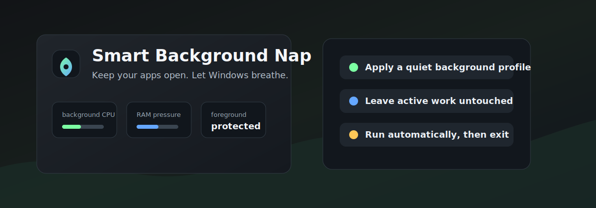
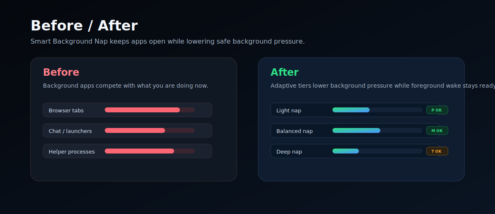
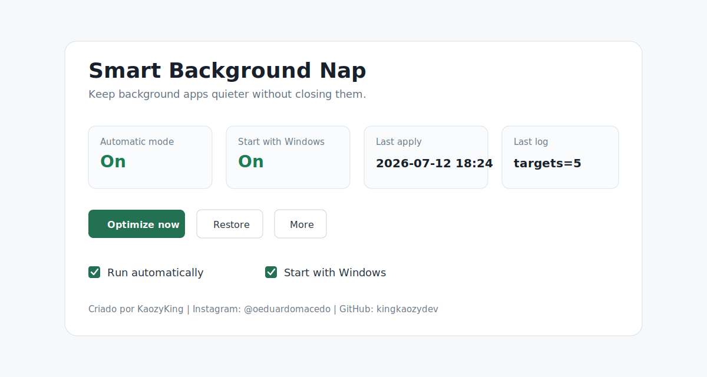
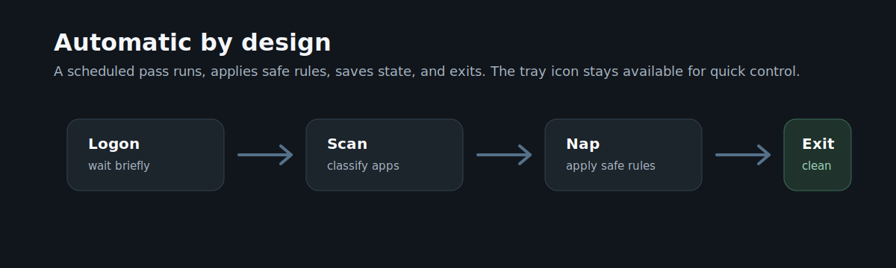

# Smart Background Nap



**Smart Background Nap** is a lightweight Windows helper that keeps background apps from getting louder than they need to be.

It is made for people who leave browsers, chat, launchers, tools, music, and capture apps open while gaming, streaming, coding, or multitasking. Instead of closing your apps, it quietly lowers safe background pressure and then gets out of the way.

Created by **KaozyKing**.

- GitHub: [@kingkaozydev](https://github.com/kingkaozydev)

> Keep your apps open. Let Windows breathe.

## What It Does

Smart Background Nap watches the current Windows user session and applies a conservative "nap" to apps that are safe to quiet down.



For selected background apps, it can apply:

- below-normal process priority
- low memory priority
- low process I/O priority
- Windows Power Throttling / EcoQoS where supported
- timer-resolution isolation for throttled background apps
- working set trimming above a configurable RAM threshold

It skips the things that should stay awake:

- Windows system processes
- services and session 0 processes
- the foreground app
- active high-CPU workloads
- configured protected apps and paths
- configured game folders

The goal is simple: reduce background noise without killing your workflow.

## Why It Exists

Modern PCs are fast, but day-to-day app stacks are noisy. A few browsers, chats, launchers, overlays, downloaders, and helper apps can keep waking the CPU, holding RAM, or competing for scheduler attention long after they stop being important.

Smart Background Nap gives those apps a softer background profile. Your apps stay open, your session stays intact, and Windows has a little more room for what you are actually doing now.

## Highlights

- Desktop dashboard: open `SmartBackgroundNap.exe` and control the app from one clean surface.
- Start with Windows toggle for the tray indicator.
- Run automatically toggle for scheduled background passes.
- Built-in safety report with local integrity details.
- Low I/O priority for safe background apps to reduce disk contention.
- Automatic scheduled optimization every few minutes.
- Tray icon with status, apply-now, log, folder, and README shortcuts.
- No heavy always-running optimizer service.
- Foreground app protection.
- Active workload protection.
- Configurable JSON rules.
- Manual, automatic, watch, restore, and browser-only modes.
- Auditable PowerShell core.
- Lightweight compiled C# WinForms tray indicator.





## Install

Download the latest release and open:

```text
SmartBackgroundNap.exe
```

Then click:

```text
Run automatically
Start with Windows
```

Those toggles enable automatic optimization and the tray icon startup task.

Smart Background Nap creates two scheduled tasks:

```text
SmartBackgroundNap
SmartBackgroundNapTray
```

The optimizer task runs after logon, repeats every few minutes, applies a pass, writes a compact log, and exits.

The tray task starts the same `SmartBackgroundNap.exe` in tray mode so you can see that Smart Background Nap is available after every login.

The release download is a single executable. Runtime scripts, default config, README text, and icon assets are embedded inside the app and extracted internally when needed.

When automatic mode or tray startup is enabled, Smart Background Nap keeps a managed copy here:

```text
%LOCALAPPDATA%\Programs\SmartBackgroundNap\SmartBackgroundNap.exe
```

That keeps startup reliable even if the original download is moved or deleted.

## Tray Indicator

The tray indicator is optional but recommended. It gives you quick access to:

- Open dashboard
- Optimize now
- Open log
- Open folder
- Open README
- Exit tray icon

Tray app:

```text
SmartBackgroundNap.exe
```

## App Controls

The dashboard includes:

- Run automatically
- Start with Windows
- Optimize now
- Restore
- More menu for logs, config, folder, safety report, security model, README, GitHub, and disabling background tasks

## Trust, Privacy, And Windows Safety

Smart Background Nap is intentionally local and boring in the places that matter:

- no telemetry
- no network calls
- no accounts, passwords, cookies, browser profiles, documents, or game files are read
- no driver install
- no Windows service install
- no startup registry key
- no administrator elevation requested by the app manifest
- no app killing
- no file deletion

Open `More` -> `Safety report` inside the app to generate a local report with the executable path, SHA-256 hash, runtime folder, scheduled-task status, and a summary of what the app does and does not touch.

The repository includes the full security model in:

```text
docs\SECURITY_MODEL.md
```

Windows SmartScreen reputation is controlled by Microsoft and is heavily influenced by Authenticode signing and download reputation. Smart Background Nap ships with product/version metadata and an `asInvoker` manifest, but unsigned community builds can still show an "Unknown Publisher" warning until a code-signing certificate and reputation path are in place.

## Configuration

Open the app and use `More` -> `Open config`.

For the single-EXE release, the default config is embedded and copied into the internal runtime folder on first use.

Useful settings:

- `BackgroundNap.PriorityClass`
- `BackgroundNap.MemoryPriority`
- `BackgroundNap.IoPriority`
- `BackgroundNap.TrimMinimumWorkingSetMB`
- `BackgroundNap.SkipHighCpuPercent`
- `BackgroundNap.HighCpuPercentThreshold`
- `BackgroundNap.ProtectedProcessNames`
- `BackgroundNap.ProtectedPathFragments`
- `Automation.IntervalMinutes`
- `Tray.RefreshSeconds`

## Logs And Restore

Smart Background Nap writes logs and restore state under:

```text
SmartBackgroundNap internal runtime folder
```

Open the app and use `More` -> `Open log` to inspect the latest pass.

Use `Restore` in the dashboard to restore the latest snapshot for currently running processes.

## Build The App

The main app source lives here:

```text
src\SmartBackgroundNap.cs
```

The legacy tray source lives here:

```text
src\SmartBackgroundNapTray.cs
```

Build it with:

```powershell
powershell -NoProfile -ExecutionPolicy Bypass -File .\build\build.ps1
```

Generated output:

```text
SmartBackgroundNap.exe
```

The root executable embeds the runtime PowerShell scripts, default config, README text, and icon asset. Source files are kept in the repository for transparency and development, but users only need the release EXE.

## What It Does Not Do

Smart Background Nap intentionally avoids risky or invasive tuning:

- no app killing
- no power plan switching
- no CPU affinity rules
- no CPU Sets
- no forced process suspension
- no overclocking
- no undervolting
- no GPU tuning
- no driver changes
- no Windows service disabling

It is a background-pressure reducer, not a miracle FPS button. Results depend on your workload, hardware, Windows version, and app behavior.

## Recommended Topics

```text
windows
windows-11
gaming
performance
optimization
background-apps
process-priority
memory-management
ecoqos
power-throttling
tray-app
powershell
winforms
cpu-optimization
ram-optimizer
```

## License

MIT License. See `LICENSE`.
