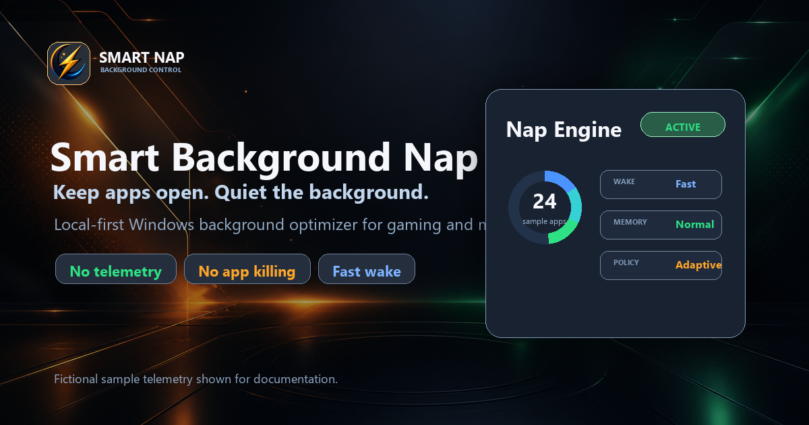
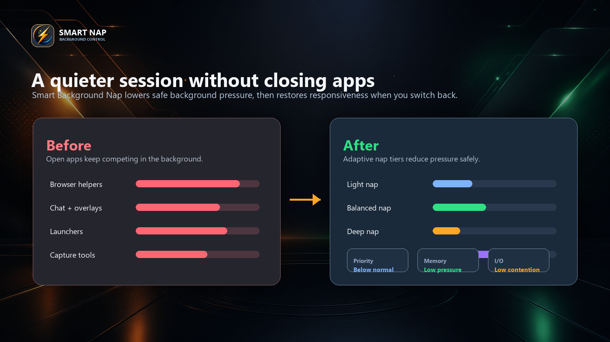
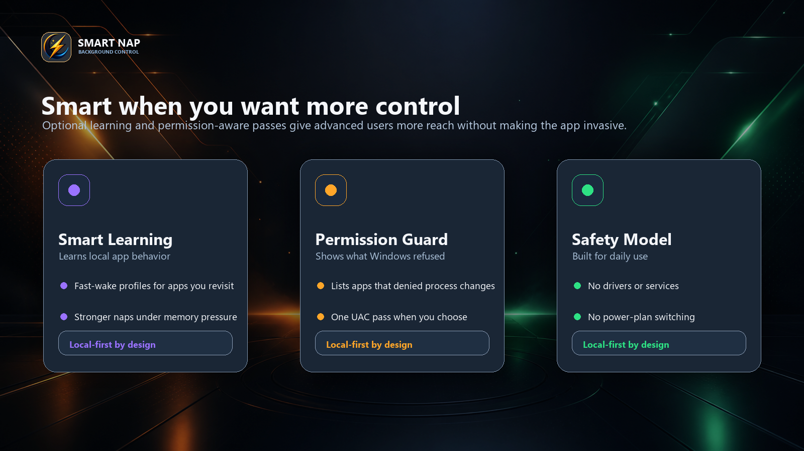

# Smart Background Nap



> All documentation screenshots use fictional sample app names, fictional telemetry, and generic hardware labels.

**Smart Background Nap** is a local-first Windows performance companion for people who keep a lot of apps open while gaming, streaming, coding, recording, or multitasking.

It does not close your apps or pretend to be a magic FPS button. It watches the current user session, identifies safe background processes, gives them a quieter profile, and restores responsiveness when you bring an app back to the foreground.

Created by **KaozyKing**.

- GitHub: [@kingkaozydev](https://github.com/kingkaozydev)
- Latest release: [Download SmartBackgroundNap.exe](https://github.com/kingkaozydev/smart-background-nap/releases/latest)

> Keep apps open. Quiet the background. Wake the foreground fast.

## Why It Feels Different

Smart Background Nap is built around one idea: background apps should stay available, but they should not compete with what you are doing right now.

Smart Background Nap keeps the scope tight. It applies process-level pressure reduction, writes compact local state, explains its decisions in the dashboard, and gets out of the way.

## What It Controls



For safe background apps, the engine can apply:

- below-normal process priority
- low memory priority
- low process I/O priority
- Windows Power Throttling / EcoQoS where supported
- timer-resolution isolation for throttled background apps
- cooldown-aware working set trimming above configurable RAM thresholds

It avoids the things that should stay awake:

- Windows system processes
- services and session 0 processes
- the foreground app
- active high-CPU workloads
- configured protected apps and paths
- configured game folders

## Key Features

- **Single EXE release**: download `SmartBackgroundNap.exe` and run it.
- **Modern dashboard**: .NET 9 / WebView2 launcher with live telemetry, event stream, and real-time manager.
- **Tray indicator**: quick access to dashboard, optimize now, logs, config, restore, and exit.
- **Automatic mode**: scheduled optimization passes after login and every few minutes.
- **Start with Windows**: managed per-user startup copy under `%LOCALAPPDATA%\Programs\SmartBackgroundNap`.
- **Intent Engine**: detects whether the session looks like desktop work, gaming, media/calls, downloads/installs, or real memory pressure.
- **Contention Radar**: reports which apps are currently creating CPU, memory, burst, or guarded workload pressure.
- **Per-app policy**: set apps to Auto, Protect, Light, Balanced, or Deep directly from the Live Manager.
- **Foreground Wake Restore**: priority, memory priority, I/O priority, and EcoQoS are restored quickly when an app becomes active.
- **Foreground Switch Accelerator**: apps you bring back repeatedly are protected from overly aggressive naps.
- **Adaptive nap tiers**: Light, Balanced, and Deep decisions based on process behavior and session context.
- **Media and launcher guards**: active calls, media, streams, game launchers, downloads, and installers are treated cautiously.
- **Smart Learning**: optional local profiles that adapt nap strength when memory pressure rises.
- **Permission Guard**: shows apps that denied changes and can request one administrator pass through UAC.
- **Multilingual UI**: Portuguese BR, English, Russian, Spanish, French, and German.
- **Safety report**: local report with executable path, SHA-256, runtime folder, task status, and behavior summary.

## Intelligence Engine

The engine works in layers. First it protects obvious no-go targets: Windows internals, session 0 services, protected paths, the foreground app, active high-CPU work, and user-protected apps.

Then it scores the remaining background apps using memory footprint, CPU sample, burst history, foreground/fullscreen context, local learning, app role, and current memory pressure. The dashboard exposes those decisions as badges instead of hiding them in logs.

The newer intelligence layer adds:

- **Intent Engine** for session-level context.
- **Foreground Switch Accelerator** for apps you return to often.
- **Per-game profile state** for pressure patterns during gaming.
- **Contention Radar** for visible CPU/RAM/burst pressure.
- **Media/Call Protection** for voice, stream, recording, and playback workloads.
- **Download/Launcher Guard** for game clients and installers.
- **Memory Pressure Governor 2.0** for Normal, Moderate, Elevated, and Critical bands.
- **One-click app policy** for manual control when you want it.

## Smart Learning And Permission Guard



Smart Learning is optional. When enabled, it builds compact local profiles from process name/path, memory use, CPU bursts, nap tier outcomes, and foreground wake events.

Apps you switch back to often can receive a lighter Fast Wake profile. Heavy idle background apps can be treated more strongly when memory pressure rises. The profile data stays on your PC.

Permission Guard is there for apps that refuse process-level changes. The dashboard lists those apps and offers one UAC-protected elevated pass. Smart Background Nap does not stay elevated, does not install a service, and does not install a driver.

## Install

Download the latest release:

```text
SmartBackgroundNap.exe
```

Open it, then use the dashboard toggles:

```text
Run automatically
Start with Windows
```

Smart Background Nap creates two per-user scheduled tasks when enabled:

```text
SmartBackgroundNap
SmartBackgroundNapTray
```

The optimizer task runs a short pass and exits. The tray task starts the dashboard/tray host after login.

## App Controls

The launcher includes:

- Optimize now
- Pause / resume motor
- Restore latest state
- Smart Learning toggle with explanation
- Permission Guard with administrator request
- Live Manager
- One-click app policy controls
- Intent Engine telemetry
- Contention Radar telemetry
- Event Stream
- Engine Telemetry
- Nap Score
- Language selector
- Local files, logs, config, safety report, README, and GitHub shortcuts

## Trust And Privacy

Smart Background Nap is intentionally local:

- no telemetry
- no network calls
- no accounts
- no browser cookies or profiles
- no documents or game files read
- no driver install
- no Windows service install
- no startup registry key
- no app killing
- no power plan switching

Windows SmartScreen reputation is controlled by Microsoft and is heavily influenced by Authenticode signing and download reputation. Smart Background Nap ships with product/version metadata and an `asInvoker` manifest, but unsigned community builds can still show an "Unknown Publisher" warning until the project has signing and reputation.

## Runtime Files

The release EXE embeds the runtime PowerShell scripts, default config, README text, security model, and image assets. Source files stay in the repository for transparency and development.

When automatic mode or tray startup is enabled, Smart Background Nap keeps a managed copy here:

```text
%LOCALAPPDATA%\Programs\SmartBackgroundNap\SmartBackgroundNap.exe
```

Runtime state is stored locally under:

```text
%LOCALAPPDATA%\SmartBackgroundNap
```

That folder contains logs, score reports, restore state, Smart Learning profiles, UI settings, and the user config override.

## Configuration

Open the app and use the config shortcut.

Useful settings include:

- `BackgroundNap.PriorityClass`
- `BackgroundNap.MemoryPriority`
- `BackgroundNap.IoPriority`
- `BackgroundNap.TrimMinimumWorkingSetMB`
- `BackgroundNap.SkipHighCpuPercent`
- `BackgroundNap.HighCpuPercentThreshold`
- `BackgroundNap.ProtectedProcessNames`
- `BackgroundNap.ProtectedPathFragments`
- `SmartMode.ForegroundWakeRestore`
- `SmartMode.AutoProtectActiveApps`
- `SmartMode.FullscreenAware`
- `SmartMode.BurstWatcher`
- `SmartMode.NapScore`
- `SmartMode.LearningEnabled`
- `SmartMode.IntentEngine`
- `SmartMode.ForegroundSwitchAccelerator`
- `SmartMode.PerGameProfiles`
- `SmartMode.ContentionRadar`
- `SmartMode.DownloadLauncherGuard`
- `SmartMode.MediaCallProtection`
- `SmartMode.MemoryPressureGovernor`
- `SmartMode.UserAppPolicy`
- `Automation.IntervalMinutes`
- `Tray.RefreshSeconds`

## Build

Build the app with:

```powershell
powershell -NoProfile -ExecutionPolicy Bypass -File .\build\build-net9.ps1
```

Main source:

```text
src\SmartBackgroundNap.cs
```

Output:

```text
SmartBackgroundNap.exe
```

README images are generated with:

```powershell
python .\tools\art\render-readme-images.py
```

## What It Does Not Do

Smart Background Nap avoids invasive tuning:

- no app killing
- no forced process suspension
- no CPU affinity rules
- no CPU Sets
- no overclocking
- no undervolting
- no GPU tuning
- no driver changes
- no Windows service disabling

It is a background-pressure reducer. Results depend on workload, hardware, Windows version, and app behavior.

## Suggested Topics

```text
windows
windows-11
gaming
performance
optimization
background-apps
process-priority
memory-management
ecoqos
power-throttling
tray-app
webview2
dotnet-9
cpu-optimization
ram-optimizer
multitasking
foreground-boost
windows-performance
```

## License

MIT License. See `LICENSE`.
