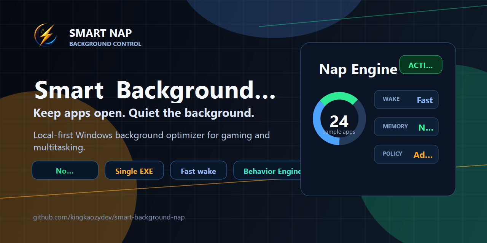
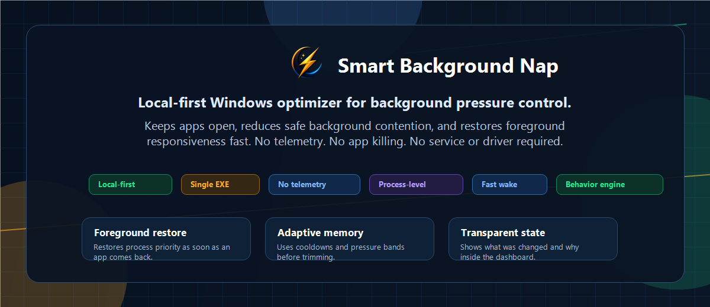
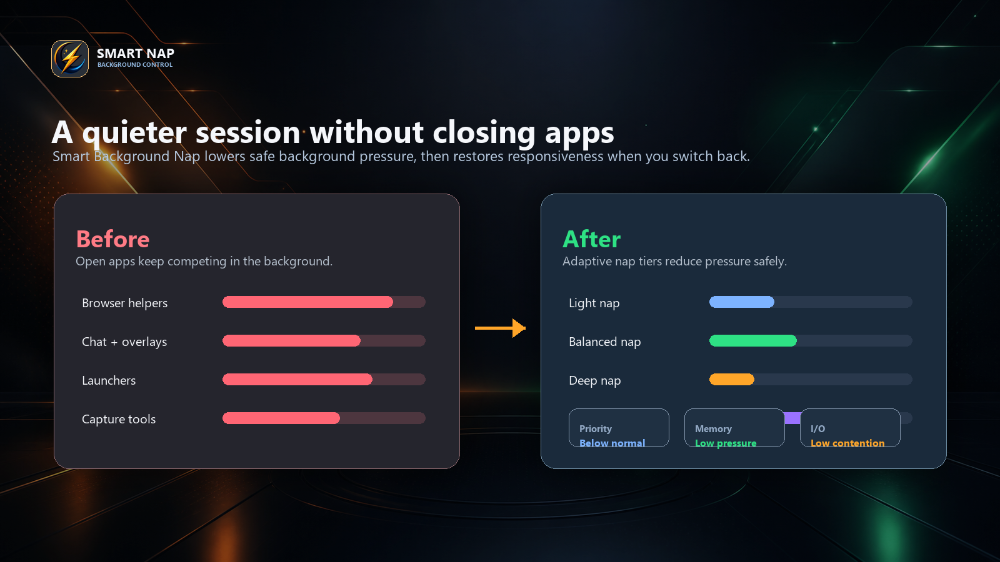
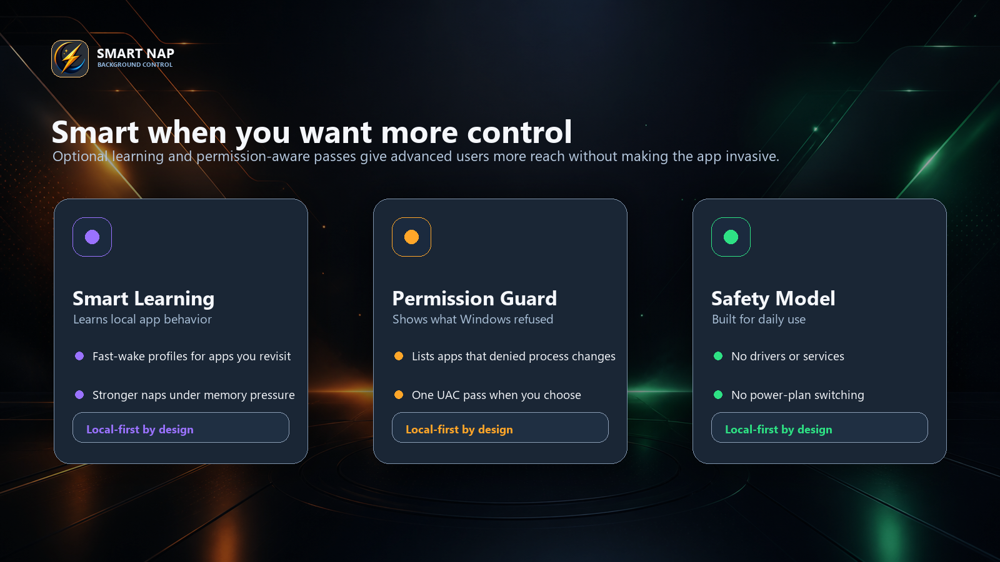

# Smart Background Nap

<p align="center">
  
</p>
<p align="center">
  
  
  
  
</p>

> All documentation screenshots use fictional sample app names, fictional telemetry, and generic hardware labels.

**Smart Background Nap** is a local-first Windows performance companion for people who keep a lot of apps open while gaming, streaming, coding, editing, recording, or multitasking.

The 0.5.60 engine combines the approved 0.5.45 dashboard experience with the newer backend: stronger foreground restore, Zero Ping for UDP game sessions, CPU-Bound Assist, GPU/VRAM pressure awareness, streamer-safe behavior, game-library presets, rollback tracking, and safer install/update handling.

It does not close your apps or pretend to be a magic FPS button. It watches the current user session, identifies safe background pressure, gives background processes a quieter profile, and restores responsiveness when an app, game, stream, or professional workload becomes important again.

Created by **KaozyKing**.

- GitHub: [@kingkaozydev](https://github.com/kingkaozydev)
- Official website: [smart-background-nap](https://kingkaozydev.github.io/smart-background-nap/)
- Latest release: [Download SmartBackgroundNap.exe](https://github.com/kingkaozydev/smart-background-nap/releases/latest)

> Keep apps open. Quiet the background. Wake the foreground fast.

## Current App Summary

Smart Background Nap is designed to reduce local contention around the task that matters right now. It is aggressive against wasted background CPU, RAM, I/O, EcoQoS, and helper-process pressure, but conservative around foreground apps, games, streaming tools, voice, anti-cheat, launchers that are still required, Windows internals, and unknown processes.

The current release focuses on:

- **Foreground reliability**: foreground apps recover their priority, I/O, memory priority, EcoQoS, and temporary affinity state when you return to them.
- **Gaming stability**: real games receive a fast protection pass, launcher/helper filtering, CPU-bound assistance, GPU/VRAM pressure awareness, and safer rollback behavior.
- **Zero Ping**: optional UDP-session protection for online games, with game/helper classification, UDP confidence, QoS/DSCP readiness, and no DNS, IP, Winsock, adapter, or driver changes.
- **Streaming safety**: OBS, Streamlabs, TikTok Studio, Discord/voice, capture, and encoder-sensitive workloads are protected while non-essential browser/helper pressure is reduced more carefully.
- **Beta Games library**: per-game discovery, community preset structure, backup-before-apply, restore-to-default flow, and apply gating so presets do not run against the wrong folder.
- **Installer and updater polish**: WebView-only runtime path, idempotent startup setup, old-runtime cleanup, internal update flow, and preservation of user settings across updates.

<p align="center">
  
</p>

## Why It Feels Different

Smart Background Nap is built around one idea: background apps should stay available, but they should not compete with what you are doing right now.

Smart Background Nap keeps the scope tight. It applies process-level pressure reduction, writes compact local state, explains its decisions in the dashboard, and gets out of the way.

## What It Controls



For safe background apps, the engine can apply:

- below-normal process priority
- low memory priority
- low process I/O priority
- Windows Power Throttling / EcoQoS where supported
- timer-resolution isolation for throttled background apps
- cooldown-aware working set trimming above configurable RAM thresholds
- temporary, reversible helper affinity containment when the engine has a safe classification
- optional QoS/DSCP policy readiness for confirmed UDP game sessions
- GPU/VRAM pressure observation to reduce surrounding contention without driver tuning

It avoids the things that should stay awake:

- Windows system processes
- services and session 0 processes
- the foreground app
- active high-CPU workloads
- configured protected apps and paths
- configured game folders

## Key Features

- **Single EXE release**: download `SmartBackgroundNap.exe` and run it.
- **Approved dashboard visual**: the 0.5.60 release keeps the cleaner 0.5.45 dashboard look while exposing the newer backend data.
- **Modern WebView launcher**: .NET 9 / WebView2 dashboard with live telemetry, event stream, Live Manager, language selector, and real-time controls.
- **Tray control**: quick access to dashboard, optimize now, pause/resume, mode switching, power actions, update actions, and exit.
- **Automatic motor**: scheduled optimization passes after login and during the session, with manual Optimize Now when the user wants an immediate pass.
- **Start with Windows**: managed per-user startup copy under `%LOCALAPPDATA%\Programs\SmartBackgroundNap`.
- **Intent Engine**: detects whether the session looks like desktop work, gaming, streaming, media/calls, downloads/installs, professional work, development, or memory pressure.
- **Foreground Wake Restore**: priority, memory priority, I/O priority, EcoQoS, and safe affinity state are restored quickly when an app becomes active.
- **CPU-Bound Assist**: reduces safe background contention around CPU-limited games and heavy workloads so the foreground workload has more room to breathe.
- **GPU/VRAM Pressure Guard**: observes GPU and VRAM pressure and reduces surrounding helper pressure without changing drivers, clocks, overclocking, or game graphics preferences.
- **Zero Ping**: optional UDP-session protection for online games with game/process-tree classification, UDP confidence, QoS/DSCP readiness, and no DNS/IP/Winsock changes.
- **Streaming Safe Lane**: protects OBS, Streamlabs, TikTok Studio, Discord/voice, capture, and encoder-sensitive sessions while treating non-essential browser helpers more carefully.
- **Game and launcher intelligence**: separates real games from Steam, EA App, Epic, browser helpers, anti-cheat helpers, and other intermediate processes.
- **Beta Games library**: community preset groundwork with local game discovery, backup/restore flow, restore-to-default, and safer apply gating.
- **Smart Learning**: optional local profiles that adapt nap strength when memory pressure rises.
- **Per-app policy**: set apps to Auto, Protect, Light, Balanced, or Deep directly from the Live Manager.
- **Permission Guard**: shows apps that denied changes and can request one administrator pass through UAC when needed.
- **Rollback and diagnostics**: restore state, safety report, event stream, and regression guard coverage for critical engine behavior.
- **Multilingual UI**: Portuguese BR, English, Russian, Spanish, French, and German.
- **Internal update flow**: checks official GitHub Releases, downloads updates inside the app, preserves settings, and cleans old runtime files.

## Intelligence Engine

The engine works in layers. First it protects obvious no-go targets: Windows internals, session 0 services, protected paths, the foreground app, active high-CPU work, and user-protected apps.

Then it scores the remaining background apps using memory footprint, CPU sample, burst history, foreground/fullscreen context, local learning, app role, and current memory pressure. The dashboard exposes those decisions as badges instead of hiding them in logs.

The newer intelligence layer adds:

- **Intent Engine** for session-level context.
- **Foreground Switch Accelerator** for apps you return to often.
- **Per-game profile state** for pressure patterns during gaming.
- **Contention Radar** for visible CPU/RAM/burst pressure.
- **Media/Call Protection** for voice, stream, recording, and playback workloads.
- **Download/Launcher Guard** for game clients and installers.
- **Memory Pressure Governor 2.0** for Normal, Moderate, Elevated, and Critical bands.
- **One-click app policy** for manual control when you want it.

## Smart Learning And Permission Guard



Smart Learning is optional. When enabled, it builds compact local profiles from process name/path, memory use, CPU bursts, nap tier outcomes, and foreground wake events.

Apps you switch back to often can receive a lighter Fast Wake profile. Heavy idle background apps can be treated more strongly when memory pressure rises. The profile data stays on your PC.

Permission Guard is there for apps that refuse process-level changes. The dashboard lists those apps and offers one UAC-protected elevated pass. Smart Background Nap does not stay elevated, does not install a service, and does not install a driver.

## Install

Download the latest release:

```text
SmartBackgroundNap.exe
```

Open it, then use the dashboard toggles:

```text
Run automatically
Start with Windows
```

Smart Background Nap creates two per-user scheduled tasks when enabled:

```text
SmartBackgroundNap
SmartBackgroundNapTray
```

The optimizer task runs a short pass and exits. The tray task starts the dashboard/tray host after login.

## App Controls

The launcher includes:

- Optimize now
- Pause / resume motor
- Restore latest state
- Smart Learning toggle with explanation
- Zero Ping toggle with explanation
- Mode selection: Auto, Gaming, Competitive, Live / Streamer, Work, and Focus
- Permission Guard with administrator request
- Live Manager with one-click app policy controls
- Beta Games library with per-game discovery and preset review
- Intent Engine, Contention Radar, Zero Ping, GPU/VRAM, CPU-Bound, and streaming telemetry
- Event Stream and diagnostic output
- Language selector
- Internal update controls
- Local files, logs, config, safety report, README, and GitHub shortcuts

## Trust And Privacy

Smart Background Nap is intentionally local:

- no telemetry
- no user data uploads
- no network calls except the optional official GitHub Releases update check
- no accounts
- no browser cookies or profiles
- no documents or game files read
- no driver install
- no Windows service install
- no startup registry key
- no app killing
- no forced power-plan switching; optional Smart Nap power profiles are user-confirmed

Windows SmartScreen reputation is controlled by Microsoft and is heavily influenced by Authenticode signing and download reputation. Smart Background Nap ships with product/version metadata and an `asInvoker` manifest, but unsigned community builds can still show an "Unknown Publisher" warning until the project has signing and reputation.

## Runtime Files

The release EXE embeds the runtime PowerShell scripts, default config, README text, security model, and image assets. Source files stay in the repository for transparency and development.

When automatic mode or tray startup is enabled, Smart Background Nap keeps a managed copy here:

```text
%LOCALAPPDATA%\Programs\SmartBackgroundNap\SmartBackgroundNap.exe
```

Runtime state is stored locally under:

```text
%LOCALAPPDATA%\SmartBackgroundNap
```

That folder contains logs, score reports, restore state, Smart Learning profiles, UI settings, and the user config override.

## Configuration

Open the app and use the config shortcut.

Useful settings include:

- `BackgroundNap.PriorityClass`
- `BackgroundNap.MemoryPriority`
- `BackgroundNap.IoPriority`
- `BackgroundNap.TrimMinimumWorkingSetMB`
- `BackgroundNap.SkipHighCpuPercent`
- `BackgroundNap.HighCpuPercentThreshold`
- `BackgroundNap.ProtectedProcessNames`
- `BackgroundNap.ProtectedPathFragments`
- `SmartMode.ForegroundWakeRestore`
- `SmartMode.AutoProtectActiveApps`
- `SmartMode.FullscreenAware`
- `SmartMode.BurstWatcher`
- `SmartMode.NapScore`
- `SmartMode.LearningEnabled`
- `SmartMode.IntentEngine`
- `SmartMode.ForegroundSwitchAccelerator`
- `SmartMode.PerGameProfiles`
- `SmartMode.ContentionRadar`
- `SmartMode.DownloadLauncherGuard`
- `SmartMode.MediaCallProtection`
- `SmartMode.MemoryPressureGovernor`
- `SmartMode.UserAppPolicy`
- `Automation.IntervalMinutes`
- `Tray.RefreshSeconds`

## Build

Build the app with:

```powershell
powershell -NoProfile -ExecutionPolicy Bypass -File .\build\build-net9.ps1
```

Main source:

```text
src\SmartBackgroundNap.cs
```

Output:

```text
SmartBackgroundNap.exe
```

README images are generated with:

```powershell
python .\tools\art\render-readme-images.py
```

## What It Does Not Do

Smart Background Nap avoids invasive tuning:

- no app killing
- no blind process suspension
- no overclocking
- no undervolting
- no driver changes
- no GPU clock, voltage, BIOS, or control-panel tuning
- no DNS, IP, Winsock, adapter, or firewall rewrites for Zero Ping
- no game input, field-of-view, sensitivity, or gameplay preference changes
- no Windows service disabling
- no broad registry-cleaner style tweaks
- no arbitrary CPU pinning; affinity is only used as a temporary, reversible containment tool for known-safe helpers when enabled

It is a background-pressure reducer and foreground-protection engine. Results depend on workload, hardware, Windows version, game behavior, streaming setup, permissions, and thermal/power limits.

## Suggested Topics

```text
windows
windows-11
gaming
competitive-gaming
performance
optimization
background-apps
process-priority
memory-management
ecoqos
power-throttling
zero-ping
udp-netcode
qos-dscp
cpu-bound
gpu-pressure
vram-pressure
obs
streaming
tray-app
webview2
dotnet-9
cpu-optimization
ram-optimizer
multitasking
foreground-boost
windows-performance
game-optimizer
```
## License

MIT License. See `LICENSE`.
